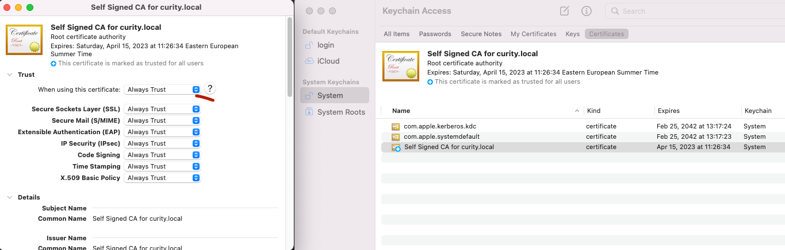

#  Curtiy Identity Server Quick Setup 

[](https://curity.io/resources/code-examples/status/)
[](https://curity.io/resources/code-examples/status/)

A docker compose based curity identity server set up for local exploration and development purposes. 
It includes an external postgres datasource and comes pre-configured with devops dashboard enabled.

## Prepare the Installation

The system can be deployed on a MacOS or Windows workstation via a bash script, and has the following prerequisites:

* [Docker](https://docs.docker.com/get-docker/)
* [Docker compose](https://docs.docker.com/compose/install/)

Make sure you have above prerequisites installed and then copy a license file to the `idsvr-config/license.json` location.
If needed, you can also get a free community edition license from the [Curity Developer Portal](https://developer.curity.io).
 
## Installation

 1. Clone the repository
    ```sh
    git clone https://github.com/suren-khatana/docker-compose-local-setup.git
    cd docker-compose-local-setup
    ./build-env.sh
    ```
 2. Start & Stop 
    ```sh
     docker-compose start
     docker-compose stop
    ```
 3. Logs
    ```sh
     docker logs -f curity-idsvr
    ```

 4. Clean up
    ```sh
     ./tear-down.sh
    ```


## Trust self-signed root CA certificate

Add the self signed root ca certificate (ca/curity.local.ca.pem ) to operating system trust store.<br>
For mac, please refer to https://support.apple.com/guide/keychain-access/add-certificates-to-a-keychain-kyca2431/mac <br> <br>


For windows, please refer to https://docs.microsoft.com/en-us/skype-sdk/sdn/articles/installing-the-trusted-root-certificate

## 
Add following to hosts file
 ```
  127.0.0.1  admin.curity.local login.curity.local
 ```

## Use the System

After the installation is completed, you will have a fully working system:

- [OAuth and OpenID Connect Endpoints](https://localhost:8443/~/.well-known/openid-configuration) used by applications
- A rich [Admin UI](https://localhost:6749/admin) for configuring applications and their security behavior
- A SQL based postgres database from which users, tokens, sessions and audit information can be queried
- A [SCIM 2.0 API & GraphQL](https://localhost:6749/admin/#/profiles/user-management/user-management/endpoints) endpoints for managing user accounts
- A working [DevOps dashboard](https://localhost:6749/admin/dashboard) for delegated administration


## Managing the Server Configuration
The default server configuration is stored in the `idsvr-config/server-config.xml` and it is imported in to the server docker image during the creation of the docker images. Any updates made to the system configuration would persist identity server restarts, however if the containers are deleted then the updates are lost and system is reset to the default configuration state.

It is recommended to back up and [export configuration](https://curity.io/docs/idsvr/latest/configuration-guide/backup.html) when needed. Backedup configuration could be imported in to the server either by using the Admin UI or by copying the configuration xml file to idsvr-config directory and re-building the idsvr docker image.


## More Information

Please visit [curity.io](https://curity.io/) for more information about the Curity Identity Server.